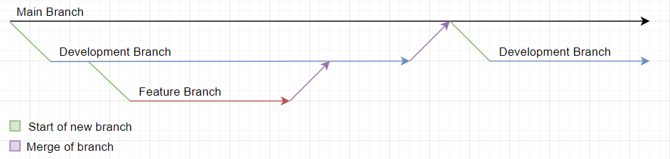
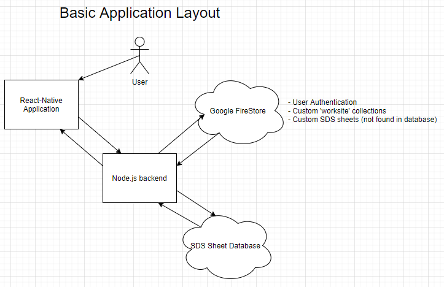

# WorkSafetyApplication

This React-Native application serves as a means of providing SDS sheets to those who need them in effective & efficient way.
The Node.js component of this application will serve as the connection to FireStore and will be use for user authentication and 'worksite' creation/manipulation.

## Contribution practices
When contributing to this repo, please remember to create a new branch for the functionality that you are working on (based on the most recent development branch). Before a demo we will merge the development branch with the main branch after all bugs have been sorted out. When in doubt, ask a team mate to double check your code before merging.


## Getting Started
1. Clone this repo (make sure you're cloning the development branch)
2. Run ```npm install``` in the root directory (will install necessary node modules for Node.js server)
3. Run ```npm install``` in the 'WorkSafetyApp' directory (will install necessary node modules for React-Native application)
4. Create a new branch from the development branch either through VSCode or git-cli to work on your feature 

## Basic Application Layout

<br />The SDS sheet database is a publicly hosted collection of Safety Data Sheets. The Node.js server can simply query that site in order to retreive the sheets meaning we wont need to store a billion of them on our hardware/google cloud. The site can be found [here](https://www.msdsonline.com/sds-search/).